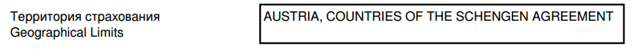
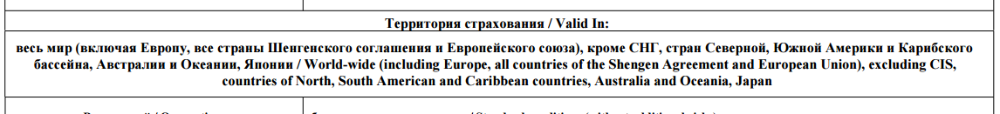
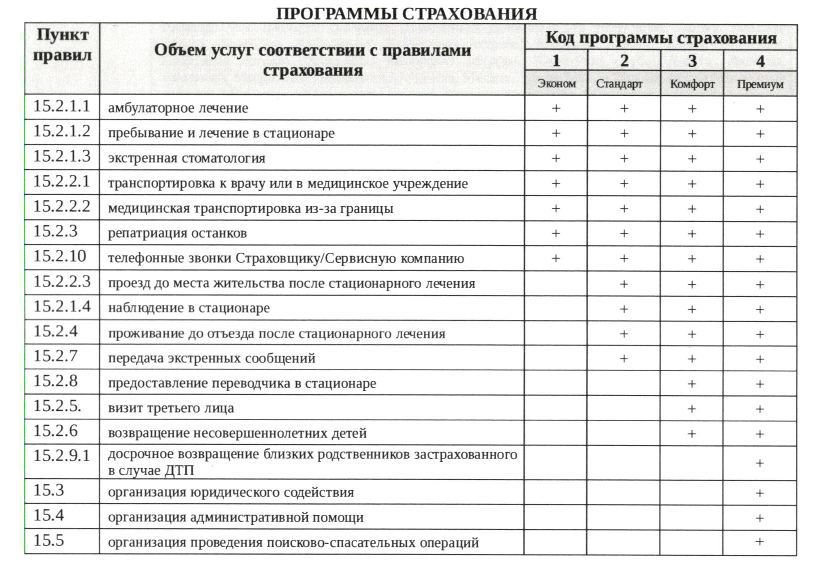

# Термины и определения

## Страховые термины

### Территория страхования (territories, territory)
Синонимы: территория действия, территория покрытия, территория действия страховки, территория страхового покрытия

> **Территория страхования.** Определенная в договоре страхования территория (страна, область, маршрут и т. п.), в пределах которой наступивший страховой случай в период действия договора страхования, влечет за собой обязательства страховщика о страховой выплате.

Территория страхования - это группа или группы стран, на территории которых действует страховой полис. Именно по ней
(а не по указанным при покупке странам) страховая компания определят действительность страхового полиса. Как правило,
в территорию страхования входит несколько стран (например, "страны Юго-Восточной Азии" или "страны Шенгенского союза"),
но иногда бывает так, что территория включает только одну страну (например "США").
В страховом полисе территория может указываться по-разному. Например:

или

Если у туриста наступил страховой случай в стране, которая не входит в территорию страхования то страховая компания откажет в выплате.
Примеры различных территорий страхования:

 * ERV: Все страны мира, кроме стран Южной и Северной Америки, в том чсиле Карибского бассейна, Японии, Австралии, Новой Зеландии, Океании и страны постоянного проживания
 * Росгосстрах: Страны Европы, СНГ, Средиземноморья, Китай
 * Ингосстрах: Страны Шенгенской зоны, а также Монако, Кипр, Андорра, Болгария, Черногория, Румыния, Мальдивские острова

В процессе расчета стоимости страхового полиса для каждой страховой компании автоматически определяется территория, которая
включает в себя все страны, указанные в запросе. При этом территория покрытия может быть шире, чем территория, определяемая странами в запросе. Например, по запросу стоимости страхового полиса в Китай и США может быть выбрана территория "Весь мир" в том случае, если у страховой компании нет более узкой подходящей территории страхования.

### Услуги (services, service)
Синонимы: страховые услуги, страховые покрытия, риски (частично соответствует), опции (частично соответствует)

> **Страховая услуга.** Специфический товар, не являющийся материальным продуктом и отражающий результат
взаимоотношений страховщика со страхователями по удовлетворению их запросов.

> **Риск.** Предполагаемое событие, на случай наступления которого проводится страхование.

> **Опция.** Необязательная, факультативная услуга, которая обычно предоставляется за отдельную плату.

Как правило, по договору (туристического) страхования, страховая компания берет на себя обязательство:

 * Оказать страхователю те или иные услуги экстренной медицинской помощи при наступлении страхового случая
 * При необходимости оказать услуги родственникам страхователя
 * Компенсировать расходы страхователя, связанные с различными рисками, оговоренными в договоре страхования

Функции оказания некоторых экстренных медицинских услуг туристам страховая компания обычно передает специальным сервисным
компаниям - ассистансам (см. ниже), при этом взаиморасчеты по оказанным услугам ведутся между компаниями самостоятельно,
а для застрахованного туриста они бесплатны. В то же время некоторые риски покрываются страховой компанией уже после оказания
сторонними организациями услуг, связанных с возникновением этих рисков.

Страховые компании по-разному используют термины для описания рисков, опций и услуг. Например, услугу "Страхование багажа"
"ВТБ Страхование" называют "страховым покрытием", "Тинькофф Страхование" - "опцией", "Росгосстрах" - "дополнительным условием",
а "Альфастрахование" - "риском".

В рамках нашей терминологии, услуги, риски, покрытия и опции называются **услугами**. У одних услуг есть страховая сумма
(например "Медицинское страхование" или "Страхование багажа"), одни услуги оказываются ассистансами, другие компенсируются
страховой компанией, одни услуги - обязательные, другие - дополнительные.

Примеры страховых услуг (в нашей терминологии):

 * Медицинское страхование
 * Транспортировка к врачу или в больницу
 * Репатриация в случае смерти
 * Экстренная стоматология
 * Помощь в результате стихийных бедствий (наводнения, цунами, торнадо и др.)
 * Купирование аллергических реакций
 * Страхование багажа на время перелета
 * Страхование гражданской ответственности
 * Страхование от несчастных случаев
 * Страхование потери документов
 * Страхование квартиры/дома на время поездки

### Страховой продукт (insuranceProducts, insuranceProduct)
Синонимы: программа страхования (частично соответствует), продукт страхования

> **Продукт страхования.** Страховая услуга, оформленная договором.

> **Страховой продукт.** Набор основных и вспомогательных услуг, предоставляемых страхователю при заключении договора
страхования.

Страховой продукт (программа страхования) - это товар, который продает страховая компания. Страховые продукты отличаются наполнением
(объемом страховых услуг) - страховыми услугами (или рисками), которые в них включены. Скажем, продукт А, который включает чуть меньше услуг и потому чуть дешевле, чем продукт Б, в котором услуг больше.

Например описание продуктов (программ) Росгосстраха выглядит так:

У разных страховых компаний может быть разный подход к формированию страховых продуктов:

 * Несколько страховых продуктов с различным фиксированным набором включенных страховых услуг
 * Один страховой продукт, состав которого можно "настраивать"
 * Смешанные подходы

(см. также Страховой субпродукт)

### Страховая сумма (serviceValues, serviceValue, value)

> **Сумма страховая.** Денежные средства, на которые окончательно застрахован объект и в пределах которых страховщик несет ответственность. Страховая сумма необходима для определения страховой преимии и масштабов риска, которому подвергается страховщик.

Страховая сумма - это максимальная сумма компенсации, которая может быть выплачена в рамках данной услуги (по данному риску)
в случае наступления страхового случая. Т.е. если в составе полиса есть услуга "Страхование от несчастного случая" на
сумму 5000USD, то максимальная сумма, которую выплатит компания составит 5000USD. Все расходы сверх этой суммы страхователь
оплачивает самостоятельно.

### Страхователь (insurers, insurer)
Синонимы: пользователь, покупатель, выгодоприобретатель

> **Страхователи.** Юридические и физические лица, имеющие страховой интерес, вступающие в отношения со страховщиком в силу закона
(обязательное страхование) или по соглашению в форме договора-согласия (добровлольное страхование).

Страхователь - это тот, кто заключает договор страхования, приобретает страховой полис. Страхователь может страховать
не только себя, но и других людей, туристов, перечень которых указывается в страховом полисе. Более того, страхователь
может заключать договор только в пользу других лиц (например муж покупает страховой полис для жены и детей, а сам
при этом в отпуск не едет).
Страхователь должен быть старше 18 лет (чтобы иметь право заключать договор страхования).

###Турист (tourists, tourist)
Синонимы: застрахованный, застрахованное лицо, страхуемый

> **Застрахованное лицо.** Лицо, в пользу которого заключается страхователем договор страхования (работник предприятия, застрахованный администрацией; ребенок, застрахованный родителями, и т.п.).

Турист или застрахованный - это человек, выезжающий за рубеж, на которого распространяется действие страхового полиса. Обычно один страховой полис может страховать не более 4-х туристов, но это зависит от страховой компании и продукта. Бывает, что пользователь покупает полис для себя - в этом случае он и страхователь и турист. Если для себя и других, то он и страхователь и в списке туристов. Если только для других, то страхователь, но не турист. При покупке страхового полиса мы проверяем туристов на существование в базе данных по имени и дате рождения.

### Страховой полис (policies, policy)

> **Полис страховой.** Письменный документ установленного образца, выдаваемый страховщиком страхователю в удостоверение заключенного договора и содержащий его условия.

Страховой полис - основной документ подтверждающий заключение договора страхования. Формы страховых полисов у каждого
страховщика свои, единого стандарта нет, однако в полисе перечисляются все основные условия, на которых заключен договор
страхования:
 * Кто страхователь
 * Кто застрахован
 * Основные услуги и страховые суммы
 * Дополнительные риски (например, занятия спортом)
 * Сроки действия договора
 * Территория страхования
 * Страховая премия (стоимость страхового полиса)

В рамках данного API страховой полис нужно рассматривать как непосредственный файл, получаемый страхователем после покупки. По результатам одного запроса, в зависимости от количества туристов, может быть сгенерирован один или несколько файлов. Каждый полис имеет свой уникальный код, получаемый от страховой компании, либо формируемый на нашей стороне (по порядку, из определенного набора кодов полисов). Полисы, в зависимости от страховой компании могут генерироваться по принципу один полис - один турист или по принципу один полис - несколько туристов.
Страховые полисы создаются после оплаты стоимости, указанной в калькуляции.

## Дополнительные термины API

### Калькуляция (calculations, calculation)
Калькуляция - это объект, создаваемый в результате проведения расчета стоимости конкретного страхового субпродукта на основании запроса пользователя. Нам не нужно записывать в БД все расчеты, которые мы проводим по конкретному запросу пользователя, а только те, по которым идут дальнейшие действия. Фактически, калькуляция фиксирует стоимость, по которой мы продаем полис. В результатах калькуляции фиксируются подробные результатры расчета стоимости продукта в разбивке по услугам и туристам.

### Запрос (requests, request)
Запрос - это объект, хранящий данные запроса пользователя: выбранные услуги и их стоимость, данные о туристах, данные страхователя, выбранные страны и даты путешествия.

### Страна путешествия (countries, country)
Страна, в которую едут путешественники. Запрос может содержать несколько стран. По странам путешествия определяется территория страхования,
указываемая в страховом полисе. В некоторых случаях от страны путешествия может зависеть валюта страховых сумм.

### Группа стран (countryGroups, countryGroup)
Группа стран, объединенная по тому или иному признаку. Например:
 * Страны СНГ
 * Страны Шенгенского союза
 * Страны Карибского бассейна
 * Страны Северной Америки

### Вид спорта (sports, sport)
Вид спорта, которым туристы планируют заниматься в путешествии. Обычно занятие тем или иным видом спорта увеличивает стоимость страхового полиса,
так как увеличивает риск страхового случая. Различают участие в спортивных соревнованиях по тому или иному виду спорта
и индивидуальное занятие этим спортом (например скалолазание и участие в соревнованиях по скалолазанию) - страховщики по разному
оценивают риски в том и другом случае. В API виды спорта, относящиеся к участию в соревнованиях помечены флагом isCompetition = true.
Как правило, различные виды спорта объединяются в группы, по которым устанавливаются повышающие коэффициенты и названия
этих групп указываются в страховых полисах.

### Задача (tasks, task)
Выписка страхового полиса - многоэтапный процесс, состоящий из множества действий. Все действия, которые необходимо выполнить,
чтобы выписать страховой полис по запросу пользователя объединяются в задачу. В рамках одной задачи могут создаваться дополнительные.
Например, если окажется, что по данному запросу нужно выписать несколько страховых полисов (в запросе указано несколько продуктов или
количество туристов в запросе превышает максимальное количество туристов в одном полисе), то процесс выписки каждого из страховых
полисов будет вынесен в дополнительную задачу, которая будет выполняться параллельно основной.
